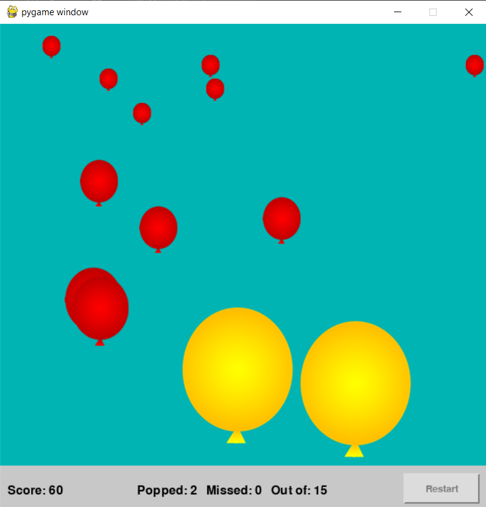

# balloon-popper
Mini game that involves popping different types of balloons to score points

# How the game works
Small red balloons are worth 30 points.
Medium red balloons are woth 20 points.
Large red balloons are worth 10 points.
Yellow megaballoons are worth 10 points.

While the red balloons only need to be clicked once for it pop to score points, the megaballoon needs to be clicked 3 times.

The number of balloons popped, missed balloons, and total balloons is indicated.

TRY TO GET AS MANY POINTS AS POSSIBLE!
